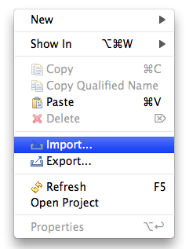
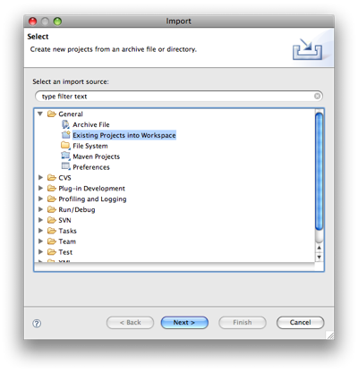
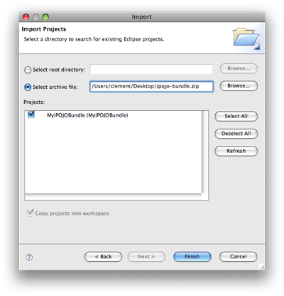
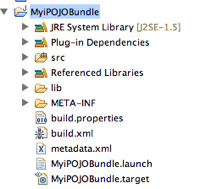
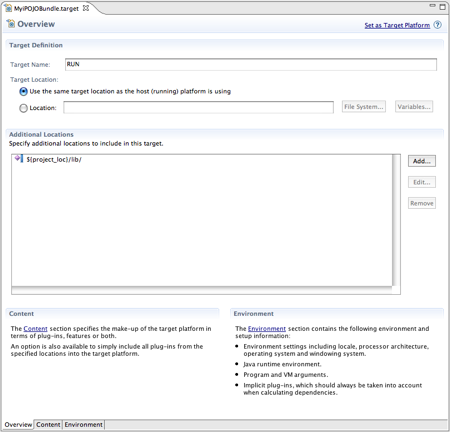
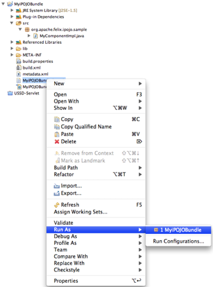
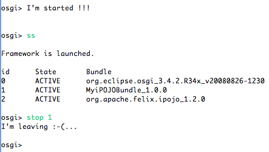

= Building and Running iPOJO bundles from Eclipse

_This page explains how to build and run iPOJO bundles without exiting Eclipse and breaking the compile-run cycle.
Bundles are executed inside Equinox._

== 1) Import the iPOJO Bundle project

Download the link:MyiPOJOBundle-1.4.2.zip[project archive], and import it as an _Existing Project into the Workspace_

  

Then click on _finish_

== 2) Configure the target platform

 

The resulting project, you looks like the left picture.

== 3) Develop you bundle

The imported project contains a very simple component using annotations.
But, obviously you can delete/change it.
For XML-metadata, use `metadata.xml` file is in the project root.

....
:::java
@Component
public class MyComponentImpl {

    @Validate
    public void start() {
        System.out.println("I'm started !!!");
    }

    @Invalidate
    public void stop() {
        System.out.println("I'm leaving :-(...");
    }

}
....

Once you're done, you are able to run your bundle !

== 4) Run your bundle

Right-click on the _.launch_ file and then go on _Run-As \-> MyiPOJOBundle_.
Equinox will be started and your iPOJO bundle deployed and started: Once run for the first time, you can re-run it from the {\{run}} icon.
In the console view, you get your Equinox shell, and you see your application result.
If you don't edit the given development, the output is as:

== Iterate :-)

Then, go back to the step 3, change your components, and see the new result...
That's it !

== Changes in the 1.4.0

[cols=2*]
|===
| The 1.4.0+ iPOJO manipulator allows manipulating classes from a directory ([FELIX-943
| http://cwiki.apache.org/jira/browse/FELIX-943]).
This feature is very convenient for the Eclipse integration because it avoids creating the Jar and unzipping it inside the Eclipse build directory.
Moreover, it allows reusing the Java Eclipse builder (compiling classes).
|===
