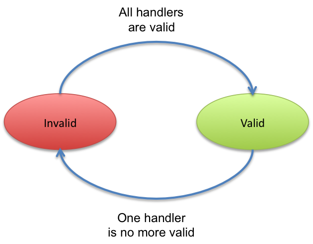

:doctype: book

Title: Lifecycle Callback Handler

= Lifecycle callbacks

_It is often necessary to create a POJO object as soon the instance becomes valid (i.e.
required services are available).
It is also often needed to be able to stop it nicely.
This pages presents the iPOJO capabilities to achieve such actions.
iPOJO allows you to invoke methods (callbacks) on the POJO object when instance's state changed.
For example, it allows invoking a `start` method when the instance becomes valid and a `stop` method when the instance becomes invalid.
It allows the creation of `immediate` component.
This page presents how to use this handler._

[TOC]

== Instance Lifecycle

iPOJO instances have a very simple lifecycle.
This lifecycle contains two states: `INVALID` and `VALID`.
Once an instance is created, this instance can only be valid if all its plugged handlers are valid.
In the most basic case it means all required services are available.
For example, an instance requiring a service (and so using the dependency handler) cannot be valid if the required service is unavailable.

An instance starts and stops in the invalid state.

== Lifecycle callback

This handler supports two kinds of callback.
The INVALID\=>VALID callback are invoked when the instance becomes valid (at starting or when an event allows the instance to become valid).
The VALID\=>INVALID callback are invoked when the instance becomes invalid (at stopping or when an event invalids the instance).

== An example

Let's take an example.
The following class requires a FooService and has two lifecycle callbacks: start and stop.

....
:::java
@Component
@Instantiate
public class Foo {
              @Requires
              FooService fs;

              @Validate
              private void start() {
                       // Starting method
                       //...
                       fs.foo();
                       //...
                }

                @Invalidate
                protected void stop() {
                        // Stopping method
            			if(fs!=null) { fs.foo(); }
                }
}
....

You can also remove the annotations to use the XML format:

 :::xml
 <component className="...Foo">
        <requires field="fs"/>
        <callback transition="validate" method="start"/>
        <callback transition="invalidate" method="stop"/>
 </component>
 <instance component="...Foo"/>

When an instance of this component type is created, the start method is called as soon as the `Foo` Service (service requirement) becomes available.
If the `Foo` Service is no more available or when the instance is stopped, the stop method is called.

The invoked methods have no argument, but could be private, protected or public.
Public methods can be in parent classes too.
Moreover, the `+INVALID=>VALID+` (validate) method can use service dependencies (the instance becomes valid means that all required services are available);
however, in the stop method (invalidate) it is possible that one of these dependency can be `null`.
Indeed, the departure of a service can be the cause of the instance invalidation.

== Managing threads

One usage of lifecycle callback is when the instance needs to create threads.
Indeed, the thread can be created in the validate callback, and stopped in the invalidate method.
The next class shows an example of a class handling a thread by using lifecycle callbacks.

....
:::java
@Component
@Instantiate
public class HelloRequesterImpl implements Runnable {

    final static int DELAY=10000;

    @Requires
    HelloService[] m_hello;&nbsp; // Service Dependency

    boolean end;

    public void run() {
      while (!end) {
        try {
        synchronized (this) {
          for(int i = 0; i < m_hello.length; i++) {
            System.out.println(m_hello[i].sayHello("Clement"));
          }
        }
        Thread.sleep(DELAY);
        } catch (InterruptedException ie) {
             /* will recheck quit */
        }
    }
   }

    @Validate
    public void starting() {
      Thread T = new Thread(this);
      end = false;
      T.start();
    }

    @Invalidate
    public void stopping() { end = true; }
....

== Invalidate callbacks and services

The invalidate callback has to be developed defensively.
Indeed, inside this callback, it might be possible that a service is no more there (the departure of this service has thrown the instance invalidation, which calls the callback).
So, you must check that the service is not `null` before using it:

 :::java
 @Invalidate
 public void stop() {
   if (myservice != null) {
     // you can use the service
   }
   // ...
 }

Thanks to the iPOJO synchronization model, you can be sure that if the service is available, it will be there until the end of the method.

== Immediate component

An instance of an `immediate` component type is instantiated as soon it becomes valid.
It means that, when the instance becomes valid, the constructor of the implementation class is called.
This can replace the validate callback.
However, it stills a difference between the immediate and the validate callback.
The constructor is call only once time.
The validate callback is re-called each time the instance becomes valid.
Components that do not provide services are automatically set as immediate.

To set a component as immediate you must add the `immediate` attribute to `component`:

 :::java
 @Component(immediate=true)
 @Instantiate
 public class MyComponent implements MyService {
    // ...
 }

However as there is no 'destructor' in Java, the invalidate callback is necessary if some actions are needed when stopping.

== Callback on several objects

If you instance has created several objects (called the implementation class constructor several times), the callback is called on each object in the creation order.
